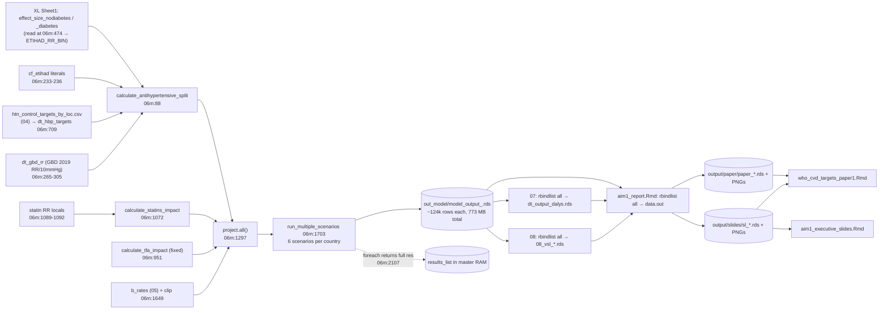

# PSA uncertainty-interval pipeline: feasibility review

*Review date: 2026-09-22. Branch `william`, commit `831d94b`, plus two uncommitted edits (`code/00_run_model.R`, `code/06_run_scenarios_multiple.R`). Brief: [`review_psa_feasibility_prompt.md`](review_psa_feasibility_prompt.md).*

This was a read-only review. No repository file was edited, created or moved during it, and no R was run. Code and data were inspected with read, search and git commands. Python was used only to read the xlsx workbooks as XML and to do arithmetic on the confidence intervals printed in them. Three read-only sub-agents built line-by-line inventories of the three deliverables, and their most consequential claims were checked against the source directly.

Each finding is tagged:
- **[V]** verified by reading code or data.
- **[I]** inferred from code but not numerically confirmed.
- **[R]** a recommendation that would need implementation and testing.

Every compute or storage figure is a reasoned estimate, not a benchmark.

---

## 1. Executive assessment

**Overall feasibility: yes, with moderate-to-high effort.** The model can serve as a PSA engine without changing its numerical core. Most of the work is plumbing: parameter injection, a shared summary layer, and rewiring the deliverables. Rewriting the model itself isn't needed.

**Main architectural conclusion [R].**
- Keep `project.all()` as the per-country engine.
- Inject a draw-specific parameter set through function arguments. Two of the three parameter families are hard-coded literals today.
- Compute business-as-usual (BAU) once and reuse it. No in-scope parameter touches BAU [V].
- Summarize each country-draw inside the worker into a small set of marginal tables. Workers write their own files; the master alone writes the manifest and the aggregates.
- Generate central estimates **through the same summary code** as draw 0, so central and UI values share definitions by construction.
- The three deliverables then read one estimate/UI table keyed by `estimate_id`, instead of computing numbers ad hoc from the 773 MB of detailed output.

**Highest-risk obstacles:**

1. **Uncertainty evidence exists for only one of the three families [V].**
   - BP-lowering effects: BPLTTC 2021 hazard ratios with 95% CIs are in the repo (`Appendix S6` sheet of the effects workbook).
   - BP case-fatality (CF) factors (0.24/0.36/0.76/0.20): no source, CI, SE or sample size anywhere.
   - Statin RRs (0.74/0.80/0.80/0.96): no matching CI. `rr_ir_ihd = 0.74` equals the *lower 99% limit* quoted in the adjacent code comment for CHD 0.80 (0.74–0.87), which may be a transcription error.
2. **Probable central-estimate defect in the haemorrhagic stroke (`hstroke`) incidence pathway [I].** In `calculate_baseline_incidence_gbd`, the normaliser `alpha` for hstroke uses intracerebral-haemorrhage (ICH) GBD RRs (`06m:650`). The bin RRs for hstroke are overwritten with ischaemic-stroke RRs (`06m:661`).
   - So Σ_bins prob × IR_bin ≠ IR for hstroke. Every BP scenario would rescale hstroke incidence even at zero coverage change, including 2017–2025.
   - The "inert" sodium step (`salteff = 0`) would rescale it again from 2026 in All Interventions.
   - This would propagate identically into every PSA draw.
   - Check: `eff_ir` is saved in every `model_output_*.rds`, so `eff_ir` for `cause == "hstroke"`, `scenario == "bp_combined"`, `year < 2026` should be exactly 1.
3. **Existing defects would get UIs attached to wrong central values [V].**
   - All-CVD ASMR under interventions uses a denominator about 4× the population (report `R:1331-1336`).
   - The slides swap the YLL and DALY column labels (`S:731-733`).
   - The manuscript's `int_order` silently drops the "HTN Control (No Diabetes)" row from Tables 1–2 and gives it an NA label in Table 3 (`M:86`).
   - Deaths are summed from 2025 but labelled 2026–2050 and divided by 25.
   - "All Interventions" includes trans-fat (TFA) elimination from 2028, which no deliverable discloses.
4. **The deliverables aren't UI-ready by structure.** Numbers are pre-formatted strings in the artefacts, several rankings depend on the estimate, and there are many typed qualitative claims ("synergistic", "IHD > ICH > IS", "Top 15 > 75%"). Some displays can't carry intervals: stacked areas, a choropleth map, and a 280-point dot plot.
5. **Compute.** About 20–25 s per country-draw for the 4 needed scenarios, extrapolated from the 2026-09-22 log timestamps. That is roughly 1,000–1,300 worker-hours for 1,000 draws: 7–9 days on the current 6 cores before any optimisation.
6. **Code structure [V].**
   - Every intervention function, input load and the cluster run sit inside the `who_cvd.execute_06` guard (`06m:254`), so none of them can be sourced without running all of Aim 1.
   - `project.all()` reads nine globals.
   - The run call hard-codes the statin settings, overriding the script-level variables.
   - Several helpers modify their inputs by reference.
7. **Storage.** Full detail per draw is about 0.8 GB, i.e. ~0.8 TB for 1,000 draws. It also lives on OneDrive, where file locking and sync make bulk writes risky.

**Is complete 95% UI coverage achievable?** Yes, for every estimate that depends on intervention effects. That covers deaths, YLL/YLD/DALYs, ASMR under interventions, and economic value, at every geography, cause, age and sex level reported. The conditions:
- Fix the defects above first.
- Retain an age-specific deaths/population table so ASMR can be recomputed per draw.
- Redesign three displays.

BAU-only quantities and the policy-target tables can't get a UI from this PSA. No in-scope parameter affects them, so they must be classed `structural/fixed` with an explicit footnote, not exempted silently. The UIs also won't reflect TFA-effect uncertainty inside All Interventions, because TFA is fixed in this scope; that must be disclosed.

---

## 2. Files inspected

Abbreviations used in the tables below:

| Abbrev. | Path |
|---|---|
| 00 / 01 | [code/00_run_model.R](../code/00_run_model.R), [code/01_utils.R](../code/01_utils.R) |
| 04 | [code/04_define_interventions.R](../code/04_define_interventions.R) |
| 05 | [code/05_build_baseline.R](../code/05_build_baseline.R) |
| 06m | [code/06_run_scenarios_multiple.R](../code/06_run_scenarios_multiple.R) (Aim 1) |
| 06t | [code/06_run_scenarios_targets.R](../code/06_run_scenarios_targets.R) (Aim 2) |
| 07 | [code/07_output_dalys.R](../code/07_output_dalys.R) |
| 08 | [code/08_economic_value_calculation.R](../code/08_economic_value_calculation.R) |
| R | [scenarios/scenarios_aim1/aim1_report.Rmd](../scenarios/scenarios_aim1/aim1_report.Rmd) |
| S | [scenarios/scenarios_aim1/aim1_executive_slides.Rmd](../scenarios/scenarios_aim1/aim1_executive_slides.Rmd) |
| M | [docs/who_cvd_targets_paper1.Rmd](../docs/who_cvd_targets_paper1.Rmd) |
| MD | [docs/math-doc.Rmd](../docs/math-doc.Rmd) |
| XL | `data/processed/ettehad_rr_bp_reduction_effects_bplttc_2021.xlsx` |

| File | Purpose / why inspected |
|---|---|
| `CLAUDE.md`, `README.md`, `dev/who_cvd_targets_paper1_coauthor_revision_work_plan.md` | Repo instructions; co-author decisions on uncertainty, case-fatality double counting, and whether economics goes in a separate paper |
| 00, 01, `02_load_inputs.R`, `03_clean_inputs.R` (empty stub) | Orchestration and flags |
| 04 | 150M target allocation (confirmed free of effect parameters); writes `statins_control_targets_by_loc.csv` (unused, target 0.80) |
| 05 | BAU rate construction; `run_CF_trend_80`; years extended to 2050 (`05:179-183`) |
| 06m | Aim 1 engine: all three parameter families, `project.all()`, parallel run |
| 06t | Aim 2 copy: checked that the helpers match and which BP files it loads |
| 07, 08 | DALY and economic valuation: whether they can run per country and per draw |
| `022_get_tps.R`, `031_calibration.R`, `032_adjustments.R` | Grepped only, to confirm no effect parameters reach calibration or baseline (none do) |
| R, S, M, MD | The three deliverables and the model equations; exhaustive inventories |
| XL (both sheets); `ettehad_rr_bp_reduction_10mmHg_bplttc_2021.csv`; the older `ettehad_rr_bp_reduction_effects.xlsx` and `…10mmHg.csv` | BP effect values, their construction and CIs |
| `data/processed/htn_control_targets_by_loc.csv`, `…summary.csv`, `statins_control_targets_by_loc.csv`, `Country_groupings_extended.csv` | Headers only: schemas, grouping source |
| `data/raw/IHME_GBD_2019_RELATIVE_RISKS_Y2020M10D15_HTN.xlsx` | First rows only, to confirm UIs are embedded in the cells |
| `output/out_model/` (listing, sizes, 3 logs), `output/paper/`, `output/slides/` | Artefact inventory; runtime and storage basis |
| `tests/test_aim2_bp_control.R` | Existing test pattern (guard off plus stubs) to reuse |

**Path resolution.**
- `scenarios/scenarions_aim1/` doesn't exist; the real directory is `scenarios/scenarios_aim1/`.
- `aim1_.Rmd` doesn't exist either. That directory holds only two `.Rmd` files: `aim1_executive_slides.Rmd` and `aim1_report.Rmd`. `aim1_report.Rmd` was taken as "the full Aim 1 report": it is the only non-slide Rmd, and it produces every `paper_*` and `sl_*` artefact.

**Working-tree state at review time [V].**
- Two uncommitted edits:
  - `00:114` comments out the Aim 2 run.
  - `06m:1962` changes `statin_target_coverage` from 0.60 to 0.50. That variable isn't used by the run call.
- `output/out_model/` held 186 Aim 1 outputs plus logs (773 MB), written 2026-09-22 between 17:06 and 17:11.

---

## 3. Current model and reporting data flow



**Central-run execution path [V].**
1. `00` sources 01, 02 (020–023), 03 (empty), then 04. 04 writes the target CSV.
2. 05 builds `b_rates`, `data.in`, `inc` and `repYear`. Years run 2017–2050; the loop to 2058 finds no rows past 2050.
3. 06m, all inside the guard:
   - loads the RR tables;
   - defines every intervention function;
   - edits the global `data.in` in place (`06m:746`);
   - loads the TFA, statin and attributable-fraction (AF) inputs;
   - clips `b_rates` (`06m:1649-1652`);
   - exports about 30 objects to 6 PSOCK workers;
   - runs `foreach(country)` → `run_multiple_scenarios` → `project.all` × 6 scenarios.
4. 07, then 08.
5. The report, slides and manuscript are knitted by hand.

`031`/`032` aren't sourced, even though `00` sets `run_calibration_par <- TRUE`.

**Where each parameter enters the model [V].**
- **BP incidence** (`06m:175-213`):
  1. Bin-specific incidence: `IR_bin = RRi·IR/alpha`.
  2. Per-subgroup incremental effect `E·(c_t − c_0)/(1 − E·c_0)` (`aim2_incremental_effect`, `06m:29`), on hypertensive bins (≥140) only (`06m:190`).
  3. Mixture multiplier `1 − (1−d)·E_nd − d·E_d` (`06m:41-50`), where `d` is the age-specific diabetes share.
  4. `IR_new = Σ IR_bin·mult·prob`, then `eff_ir = IR_new/IR`.
- **BP case fatality** (`06m:215-240`): `CF_new = CF·(1 − ρ_c·coverage_agg)`. `coverage_agg` is the probability-weighted incremental control across hypertensive bins. It doesn't depend on the RR draws.
- **Statins** (`06m:1184-1227`): for ages ≥40 and IHD/ischaemic stroke only:
  - `IR ×= 1 − AF·(1−RR_IR)·Δcov·α_IR / (1 − (1−RR_IR)·cov0·α_IR)`
  - `CF ×= 1 − [ψ]·(1−RR_CF)·Δcov·α_CF / (…)`
  - ψ = 0.60 applies to ischaemic-stroke CF only.
- **Combination rule [V].**
  - The two BP subgroups combine as an **additive population mixture** inside the split, giving a single `eff_ir_bp` (`06m:1423-1446`).
  - BP × sodium is **multiplicative** (`06m:1484-1488`). TFA then multiplies IHD CF (`06m:1027`). Statins then multiply IR and CF (`06m:1223-1227`).
  - So All Interventions = BP mixture × sodium (inert only if the hstroke issue is not real) × TFA elimination from 2028 × statins.
- **The deliverables describe this differently:**
  - The manuscript writes ε_BP × ε_BP,DM × ε_statin (`M:896-898`): a product of subgroups, with no TFA.
  - `MD:554` includes salt and TFA.
  - Both the manuscript (`M:256, 270, 1063`) and the slides (`S:978, 1054`) call the combination "synergistic" or "greater than the sum". A multiplicative combination of these effects is sub-additive; any excess over the sum would come from the undisclosed TFA component.

**Where results are combined in memory [V].**
- `foreach` returns each country's full `res` to the master (`06m:2107`). `results_list` therefore holds all ~23M rows even though the `rbindlist` is commented out (`06m:2123`).
- 07 (`07:118`), 08 (`08:170`) and the report (`R:271`) each rebuild the full cross-country table from disk.

---

## 4. Parameter audit

### 4.1 BP-lowering effects on incidence (family 1)

| Item | Finding |
|---|---|
| Model object | `ETIHAD_RR_BIN$effect_size_nodiabetes` and `$effect_size_diabetes`, by `cause × bp_cat`, read from XL Sheet1 (`06m:474`). |
| Passed as an argument? | Partly. `calculate_antihypertensive_split(…, etihad_rr_table = ETIHAD_RR_BIN)` (`06m:95`), but `project.all` never passes it (`06m:1425-1434`), so it always falls back to the global. |
| Construction [V] | Sheet1 column C `rr_per_10mmhg` holds typed values equal to HR_per_5mmHg² from the "Appendix S6" sheet, labelled "mmc1 (9).pdf, Figure S6" (BPLTTC 2021). Effects are cumulative products in Excel formulas, some pasted as values:<br>– **No diabetes** (target <140): `E_nd(k) = 1 − Π_{j=140–149…k} RR_j`<br>– **Diabetes** (target <130): `E_d(k) = 1 − RR_{130–139} · Π_{j=140–149…k} RR_j` |
| Cause mapping | `ihd` ← Ischaemic heart disease; `istroke` **and** `hstroke` ← Stroke (identical values); `hhd` ← Heart failure; `aod` ← copy of HF (unused). Bins 170–179 and 180+ both use the ≥170 estimate. |
| What differs by diabetes status | Diabetes status changes **only the number of 10-mmHg steps**; there are no diabetes-specific RRs. Both effect columns derive from the same bin RRs, so they must come from the same draw. |
| Uncertainty in repo [V] | **Yes.** HR per 5 mmHg with 95% CIs for every bin used. The RR10 CI is the squared HR CI; the CSV `…10mmHg_bplttc_2021.csv` duplicates this. |
| Covariance | None. |
| Duplicates / conflicts [V] | – Aim 2 (`06t:304, 459`) loads the **older Ettehad 2016 files** (e.g. IHD 140–149 RR10 0.80 vs 0.8836 in Aim 1), so Aim 1 and Aim 2 use different BP effects.<br>– The manuscript and slides cite Ettehad 2016 (`M:157, 802`; `S:251, 256, 489, 1112, 1150, 1224, 1301`) and never print the values.<br>– `calculate_etihad_cumulative_rr(diabetes_weight = 0.1)` (`06m:483`), which `MD:79` documents as the old default, now feeds only the sodium path.<br>– Workbook column I holds unlabelled ratios, which `read_excel` will import as a stray column. |

The 15 sampled parameters this implies:

| Proposed `param_id` | Outcome, BPLTTC bin | HR/5 mmHg (95% CI) | Central RR10 | log RR10 | SE(log RR10)* | P(draw RR>1) |
|---|---|---|---|---|---|---|
| `bp_rr10_chd_130_139` | IHD 130–139 (diabetes step only) | 0.96 (0.88–1.04) | 0.9216 | −0.0816 | 0.0852 | 0.17 |
| `bp_rr10_chd_140_149` | IHD 140–149 | 0.94 (0.87–1.02) | 0.8836 | −0.1238 | 0.0812 | 0.06 |
| `bp_rr10_chd_150_159` | IHD 150–159 | 0.91 (0.83–0.99) | 0.8281 | −0.1886 | 0.0899 | 0.02 |
| `bp_rr10_chd_160_169` | IHD 160–169 | 0.87 (0.80–0.95) | 0.7569 | −0.2785 | 0.0877 | <0.01 |
| `bp_rr10_chd_ge170` | IHD ≥170 (170–179 and 180+) | 0.94 (0.88–1.01) | 0.8836 | −0.1238 | 0.0703 | 0.04 |
| `bp_rr10_stroke_130_139` | Stroke 130–139 | 0.92 (0.83–1.02) | 0.8464 | −0.1668 | 0.1052 | 0.06 |
| `bp_rr10_stroke_140_149` | Stroke 140–149 | 0.90 (0.82–0.99) | 0.8100 | −0.2107 | 0.0961 | 0.01 |
| `bp_rr10_stroke_150_159` | Stroke 150–159 | 0.77 (0.65–0.92) | 0.5929 | −0.5227 | 0.1772 | <0.01 |
| `bp_rr10_stroke_160_169` | Stroke 160–169 | 0.86 (0.79–0.94) | 0.7396 | −0.3016 | 0.0887 | <0.01 |
| `bp_rr10_stroke_ge170` | Stroke ≥170 | 0.90 (0.84–0.97) | 0.8100 | −0.2107 | 0.0734 | <0.01 |
| `bp_rr10_hf_130_139` | HF 130–139 | 0.85 (0.75–0.97) | 0.7225 | −0.3250 | 0.1312 | <0.01 |
| `bp_rr10_hf_140_149` | HF 140–149 | 0.95 (0.85–1.07) | 0.9025 | −0.1026 | 0.1174 | 0.19 |
| `bp_rr10_hf_150_159` | HF 150–159 | 0.88 (0.78–1.00) | 0.7744 | −0.2557 | 0.1268 | 0.02 |
| `bp_rr10_hf_160_169` | HF 160–169 | 0.70 (0.61–0.80) | 0.4900 | −0.7133 | 0.1383 | <0.01 |
| `bp_rr10_hf_ge170` | HF ≥170 | 0.89 (0.79–1.00) | 0.7921 | −0.2331 | 0.1203 | 0.03 |

\*SE(log RR10) = 2·[ln U₅ − ln L₅]/3.92, which is the same as [ln U₁₀ − ln L₁₀]/3.92. Log-scale asymmetry of the printed CIs is 0.92–1.09, so a log-normal fits well.

Manuscript labels for these: "Ettehad RR per 10 mmHg", E_trial, E_noDM, E_DM (`M:696, 753, 938-942`).

### 4.2 BP case-fatality reduction factors (family 2)

| Item | Finding |
|---|---|
| Model object | `cf_etihad$cf_reduction_per_control = c(ihd 0.24, istroke 0.36, hstroke 0.76, hhd 0.20, aod 0.047)`, a **literal inside** `calculate_antihypertensive_split` (`06m:233-236`), applied at `06m:238`. Not an argument. |
| Duplicates | `06m:898-901` (sodium; dead code because `CF_new := CF` at `06m:916`); `06t:222-224, 812-814, 1043-1045`; `M:727, 749-752, 788, 974` (ρ_CF); `MD:169-176`; `S:1213-1214`; the Aim 2 slides. |
| Source / uncertainty [V] | None anywhere. `M:802` attributes the factors to "Ettehad et al. 2016", but the repo gives no derivation. The co-author plan flags them as possible double counting (`dev/…work_plan.md:46, 54, 126, 161`). |
| Recommendation [R] | **Keep them fixed in the PSA.** Evaluate by deterministic sensitivity analysis (DSA) instead: ρ × {0, 0.5, 1.0}, where 0 means incidence-only (the co-author plan's recommended primary). Don't use 1.5×: 1.5 × 0.76 > 1 could push hstroke CF negative. |

### 4.3 Statin effects (family 3)

| Item | Finding |
|---|---|
| Model objects [V] | `rr_ir_ihd = 0.74`, `rr_ir_istroke = 0.80`, `rr_cf_ihd = 0.80`, `rr_cf_istroke = 0.96`. These are **local literals** inside `calculate_statins_impact` (`06m:1089-1092`; identical at `06t:1234-1237`). Not arguments. |
| Related fixed quantities | AF defaults 0.1497/0.1161 (`06m:1098-1099`) and country AFs from `af_statins.rds`; ψ `prop_athero_stroke = 0.60`, applied to ischaemic-stroke CF only (`06m:1548`); adherence. |
| Uncertainty in repo [V] | The comment at `06m:1058-1063` cites CTT 2010 (doi …61350-5): major CVD "0.78 (0.77–0.81)" and CHD "0·80, 99% CI 0·74–0·87", with "Source: Trials 2015". **None of the four values in use has a matching CI**, and `0.74` equals the lower 99% limit for CHD. |
| Source conflicts | The CF RRs have no source at all. The manuscript cites CTT 2015 / `Fulcher2015` (`M:157, 1031`) and elsewhere `Reith2026` (`M:266`); `MD:415-416` cites no one. The slides repeat the values (`S:1270-1271`). Manuscript notation is RR^IR, RR^CF, δ (`M:760-763, 1028-1029`). |
| Run settings (fixed) [V] | The run call passes literals: coverage 0.50, start 2026, **target 2030, adherence_ir = adherence_cf = 1** (`06m:2072-2076`). These override the script variables at `06m:1962-1966` (0.50 after the uncommitted edit, 2050, 0.575/0.664) and the function default of 0.60/2050 (`06m:1079-1081`). `04:925` writes a 0.80 statin target file that nothing reads. |

### 4.4 Other intervention inputs that stay fixed but should be disclosed [V]

- **`dt_gbd_rr`** (GBD 2019 RR per 10 mmHg): used only in the intervention pathway, to split incidence across BP bins. The raw cells carry UIs, e.g. "1.972 (1.44 to 2.596)", which the regex at `06m:278` strips. It is a natural later PSA extension, and adding it would not break BAU reuse.
- **TFA:** age-specific RR per 1% of energy, `06m:985-1000`.
- **Sodium:** `salteff = 0` in the run.

---

## 5. Feasibility of the streaming PSA architecture

| Proposed step | Verdict | What is needed |
|---|---|---|
| 1. Keep the detailed central run | Adopt | Keep the per-country RDS (`06m:2100`) as the source for diagnostics and the BAU cache. Stop returning `res` to the master (`06m:2107`); return a status row instead. |
| 2. Compute BAU once and reuse it | **Adopt: safe [V]** | See below. |
| 3. Master parameter-draw table | New | Draws generated before any model execution (§7–8). |
| 4. Run per draw × country, summarize, discard | **Refactor needed** | See the list below. |
| 5. Keep report-relevant summaries only | Adopt, with changes | Separate marginal tables beat a cube. They must add age-specific deaths/population for ASMR and the extra sums the economic step needs (§7). |
| 6. Restartable batch writes | New | One file per (batch, country), written by that task only; atomic rename. |
| 7. Manifest | New | Written by the master only. |
| 8. Percentiles | Adopt | Central = draw 0 through the same code; median kept as a diagnostic. |
| 9. Presentation-ready UI layer | New, and the largest piece | The deliverables currently compute numbers in about 60 places (§6). |

**Refactoring needed for step 4 [R]:**
- **(a)** Move function definitions and input loading out of the `execute_06` guard into a module that both 06m and the PSA runner source.
- **(b)** Add a `params` argument to `project.all` → `calculate_antihypertensive_split` (BP table plus a `cf_reduction` argument) and → `calculate_statins_impact` (`statin_rr` argument). Defaults must equal today's values, so central outputs don't change.
- **(c)** Replace the self-referential defaults `adherence_ir = adherence_ir` and `adherence_cf = adherence_cf` (`06m:1309-1310`).
- **(d)** Collect the fixed policy settings, now split across three conflicting places, into one config object.
- **(e)** Turn the 07 and 08 logic into per-country functions (below).
- **(f)** Guard against in-place modification before caching anything across draws. `expand_to_single_year_ages` rewrites `age` in its input (`06m:562`); `get.bp.prob` adds columns to `DT.in` (`06m:591-606`). Use `copy()` at the entry points.

**BAU reuse [V].**
- `baseline` runs `project.all(interventions = character(0))`. No intervention function is called, and the rates are `b_rates` with `eff = 1`.
- None of the three families appears in 04, 05, 022, 031 or 032 (grep, plus reading 04 and 05).
- The 04 allocation uses only prevalence, population, control and diabetes share (`04:126-191`).
- Things that would break reuse later:
  - adding baseline inputs (GBD rates, BG.mx/CF trends) to the PSA;
  - letting the `run_CF_trend_80` 0.8 factor (`05:359-363`) co-vary with BP CF effects;
  - changing the `b_rates` clipping or input loading between the BAU cache and the PSA run.
- **Cache contents:** the Tier A summary tables at *scenario levels* for BAU, taken from the draw-0 run (§7), plus BAU-only 2019–2025 series for the trend figures. Workers then never recompute BAU. The reducer forms averted = BAU − scenario. That subtraction is linear, so it matches the current cell-level differencing to floating-point precision.

**Validation of BAU reuse:**
- The cache records input hashes (`b_rates` slice md5, git commit).
- The runner recomputes BAU for a random 10 countries, and the result must be `identical()` to the cache (§10, V4).

**Moving the DALY (07) and economic (08) logic per country [V].**
- YLL and YLD are cell-wise products with lookups: `yll = dead·le(loc, age, yr)`, `yld = sick·dw(loc, cause)` (`07:172-179`). Workers can compute them if they get `dw` and `lt_interp`.
- Economic value is linear at country-year level with fixed lookups:
  - VSL value = `vsl(loc, yr) · deaths_averted(loc, yr)` (`08:684-687`).
  - VSLY value = `vsl/le_avg_adult · Σ_a deaths_averted(a)·le₅(a)` (`08:619-628, 676-702`).
- One exception: `le_avg_adult` depends on the **scenario-specific** average adult age (`08:506-530`). Workers must return Σpop and Σpop·age for ages ≥20 so the reducer can reproduce it exactly.
- Denominators (`population × gni_pc_disc_r3`) are fixed.
- Minor inconsistency: 07 uses single-year life expectancy; 08 uses the 5-year lower-bound value (`08:593`).

**Parallelism [R].**
- Use **country-major tasks within draw batches**: task = (country, batch of B ≈ 25–50 draws).
- Each task runs its draws and summarizes them, then writes one file. It can precompute draw-invariant pieces once per task: BP-bin expansion, GBD joins, `IR_bin`, diabetes shares, control trajectories, and the `coverage_agg` that drives BP CF.
- Parallelizing across draws would make every worker hold every country's inputs and give up that caching. Country-within-single-draw jobs would add 1,000 synchronization barriers.
- All randomness lives in the draw table, so results don't depend on worker count or task order.

**Failures [R].**
- Retry a task once. If it fails deterministically, mark every country of that draw as excluded. **Never drop a single country from a draw**, because that biases the aggregates.
- If more than 1% of draws fail, stop and investigate; failures tied to particular parameter values are not ignorable.
- `.errorhandling = "pass"` plus `tryCatch → NULL` (`06m:2051, 2085-2088`) must become explicit status rows.

**Restart [R].** A task counts as done only when three things hold: its file exists, it passes schema and row-count checks, and its `draw_id` set equals the expected set. Anything else is re-run. The reducer is idempotent per batch.

---

## 6. Report-output dependency matrix and UI-coverage audit

Deliverable codes: **R** = full report, **S** = executive slides, **M** = manuscript (line numbers). Tables named `psa_*` are defined in §7.

Statuses:
- **UI ready**: the proposed summaries give the UI.
- **+dims**: extra retained dimensions are needed (already included in §7).
- **fixed**: structural, with a justification.
- **unresolved**: a decision is still needed.

Every "averted" UI must be computed per draw from unrounded values. Formatting happens only at render time.

| ID | Estimate family | Where shown | Current source | Dimensions / horizon | PSA table | Display with UI | Status / limitations |
|---|---|---|---|---|---|---|---|
| E01 | Cumulative deaths averted, global, by intervention | R 825–830, T1 867, Fig1 909; S 573–585, 1050; M 110, 130, 216–226, 256, 302, T1 314 | `dt_cumul` (R 807) → `sl_scalars`, `paper_scalars` | 4 interventions; labelled 2026–2050, computed from 2025 | `psa_geo_year_cause` (global, all) | Inline "X.X million (95% UI a–b)"; table central/lower/upper; bar + error bar | UI ready after harmonising the horizon |
| E02 | Average deaths averted per year | R T1 841; S `avg_yr`; M T1 325 | ÷25 | as E01 | derived | Table column | UI ready; the divisor must match the window |
| E03 | % of BAU deaths averted | S `pct_s`; M 110, 216–226, 256, T1 326 | ratio; `pct_*` pre-rounded (R 2315–2318) | intervention | derived per draw | Inline "x.x% (a–b)" | UI ready; BAU is fixed, so the UI reflects the numerator only (footnote) |
| E04 | Annual deaths averted by year; 2030/2050 values | R Fig3 1015 (stacked area); S 588–621 (stacked area, caption wrong); M S3; inline M 216, 226, 260 | `dt_annual` | intervention × year | `psa_geo_year_cause` | **Unstacked** lines + ribbons; inline UI | UI ready; display redesign needed |
| E05 | Cumulative trajectory | R Fig4 1046; S 623–642; M Fig 1 | cumsum | intervention × year | cumsum per draw | Line + ribbon | UI ready |
| E06 | Deaths averted by cause | R T2 946, Fig2 992; S 644–659; M T2 336, S5, inline 222, 228, 266 | `dt_tab2`, `dt_fig2`, `sl_dt_cause`, `averted_*` | intervention × 4 causes | `psa_geo_year_cause` | Table columns; dodged bars + error bars (not stacked) | UI ready. Statin hstroke/hhd competing-risk rows appear in some outputs and not others (R 923 vs Fig2) |
| E07 | By age group × sex; <70, 70+, male, female | R Fig5 1130, T3 1161; S 661–675; M Fig 2, inline 238–242 | `dt_age_sex`, `dt_tab3`, `sl_dt_age` | intervention × age group × sex, cumulative | `psa_agesex_cum` | Error bars; table columns | UI ready. The 70+ value must be summed per draw (M 238). The saved factor order depends on the estimate |
| E08 | By WHO region, cumulative, with % | R T5 1316; S 794–810; M T4 392; `paper_dt_region`, `sl_tab_region` | `dt_tab5` | region, All Interventions | `psa_geo_year_cause` (who_region) | Table columns; order fixed by central | UI ready, but needs a single canonical location→region map (R 199–258 vs 08 787–868 differ) |
| E09 | Regional cumulative trajectory | R Fig4b 1091; M Fig 3 | `dt_region_annual` | region × year | same | Faceted ribbons | UI ready |
| E10 | By country, cumulative, with % | R T4 1206 (DT), Excel T4; `paper_dt_country` (unused in M) | `dt_tab4` | country | `psa_cty_year_cause` | Table columns | UI ready |
| E11 | Map of deaths averted per 100k | R 1280; M S7 | `dt_map` (fixed WPP 2019 20+ denominator) | country | `psa_cty_year_cause` | Central choropleth, plus a companion supplementary table of country values with UIs, plus an optional map of relative UI width | UI ready via the companion display |
| E12 | Top-N countries; "Top 15 > 75%" | R Fig 1241 (top 20); S `sl_tab_top15` (slide disabled), claim S 973; `top5_*` (unused) | ranking | country | `psa_cty_year_cause` | Rank fixed by central value; bars + error bars; top-N share computed per draw with fixed membership; optional P(in top N) | **Unresolved:** the ranking convention; the S 973 claim is unsupported |
| E13 | Scenario deaths ("projected"), T3–T5 | R T3–T5 | BAU − averted | age / country / region | derived | Table columns | UI ready |
| E14 | BAU deaths (totals, baseline columns, `bau`) | M 110, 212; R T3–T5; S tables | `bau_total_deaths` (R 1672) | various | `bau_*` (draw 0) | Point value + footnote: "BAU is unaffected by the intervention-effect PSA" | **fixed**: no in-scope parameter affects BAU |
| E15 | BAU incident/prevalent trend | R 739; S 545; M S1 (caption mismatch) | `dt_trend` | year | `bau_*` | Line, no ribbon, with footnote | **fixed**. Prevalence is summed across causes (double counting) |
| E16 | BAU cause-specific ASMR index | R 783 | `asmr_cause` | cause × year | `bau_*` | Line | **fixed** |
| E17 | All-CVD ASMR by scenario × year | R 1360; S 550–568; M S4 | `asmr_int`: **denominator about 4× population** (R 1331–1336); coarse step weights (R 144–157) | scenario × year | `psa_asmr` (from age-specific deaths and population per scenario) | Lines + ribbons (the BAU line is fixed) | **+dims**, and the defect must be fixed first |
| E18 | YLL / YLD / DALYs averted, cumulative, by intervention | R 1437; S 710–741 (**labels swapped**); M 110, 130, 216–226, 302, T3 370 | `bod_tab1`, `sl_scalars`, `paper_scalars` | intervention; 2026–2050 | `psa_geo_year_cause` | Inline; table columns | UI ready after the S and M label fixes |
| E19 | Burden by cause, with cause shares | R 1482; `paper_bod_cause` (unused) | `bod_tab2` | intervention × cause | same | Table | UI ready (shares per draw) |
| E20 | Burden by region | R 1516, Fig 1614 | `bod_tab3`, `bod_region_all` | region | same | Table / bars + error bars | UI ready |
| E21 | Burden by income group | R 1550; M T5 413 | `bod_tab4`, `income_tab` | income group | same (wb_income) | Table | UI ready; canonical income map needed (blank income forced to "L" at R 243) |
| E22 | Cumulative DALY trajectory | R 1584; M S6 | `bod_annual` | intervention × year | same | Ribbon | UI ready |
| E23 | World VSLY value and share of income, cumulative | S 853, 1062; M 246, 284 | `sl_econ_scalars` ← 08 | World, All Interventions, primary elasticity (e1_2), 3% | `psa_econ` | Inline | UI ready once draws pass through valuation |
| E24 | VSLY by region, value and share | S 874–879; M T6 437 | `sl_econ_vsly_primary` | region | `psa_econ` | Table | UI ready |
| E25 | VSL/VSLY × region × period × intervention × elasticity | S dot plot 951; M S8; `08_*summary*` | `sl_econ_dotplot_dt` | 7 × 5 × 4 × 2 | `psa_econ` | Whiskers on the primary elasticity only; show e1_5 separately as a DSA | UI ready. Elasticity e1_5/e1_0 is a structural sensitivity, not a UI |
| E26 | HTN control targets (additional controlled, coverage) | R 506–627, inline 536–540, typed "83.8 M / 66.2 M" at 568; S 285–407 | `control_summary` ← 04 | region × subgroup | none | Plain values labelled "policy target (fixed)" | **fixed**; the typed 568 text should be computed |
| E27 | Policy input plots | R 657 (legacy `covfxn2`), 696 (path bug; skipped) | inputs | — | none | — | **fixed** |
| E28 | Effect-parameter tables | M 723–842, 974, 1028; S 1213–1214, 1270–1271; MD | typed | — | `psa_param_sources` | Regenerate from draw metadata, showing central, 95% CI and distribution | **fixed** (inputs), but must be rebuilt to avoid drift |
| E29 | `n_countries`, study years | R 350; S; M 2 ("190 countries" typed), 93 | scalars | — | — | — | **fixed** |
| E30 | Qualitative ranking / comparison claims | M 114, 134, 212, 216, 228, 232–240, 256, 266, 270, 276, 1063; S 746, 809, 969–978, 1054, 1061 | typed | — | `psa_claims` | Restate as "in x% of draws" or remove | **unresolved**. The super-additivity claims conflict with the model (§3) |
| E31 | "HTN control total" = bp + bpd | M 260 | typed sum | — | per-draw sum, or the `bp_combined` scenario | Inline | **unresolved**: report `bp_combined` directly? |
| E32 | Excel workbook | R 1622–1653 | pre-formatted strings | T1–T5 | as E01–E10 | Lower/upper columns | UI ready |
| E33 | Deaths averted under `bp_combined` (the 150M policy) | none (dropped R 316, 07:146) | — | — | would need the scenario in the PSA | — | **unresolved** |

**Results the proposed summaries can't reproduce without extra retention:** ASMR (E17) needs age-specific deaths and population by scenario and year. Anything cross-classified beyond the planned marginals would require either keeping the Tier A country tables or re-running. Examples are cause × region, age × region, and region × year × cause.

---

## 7. Recommended data schemas [R]

Conventions:
- `run_id` = UTC timestamp + short git hash.
- `draw_id`: 0 = central, −1 = null effect (validation only), 1…N = PSA draws.
- `scenario_id` ∈ {`bp_no_diabetes_only`, `bp_diabetes_only`, `statins_only`, `all_interventions`, [`bp_combined`]}.
- `cause` ∈ {`ihd`, `istroke`, `hstroke`, `hhd`}; "`all`" is created only when aggregating.
- Years 2026–2050, unless the horizon decision in §11 changes.

**7.1 Parameter sources: `data/processed/psa_parameter_sources.csv`.** Primary key `param_id`.
- Columns: `param_id, family (bp_incidence|bp_cf|statin), outcome, bp_bin, model_target, scale (log_rr|proportion), central, ci_lower, ci_upper, ci_level, source_scale_note, distribution (lognormal|fixed), corr_group, source_id, source_citation, notes`.

**7.2 Parameter draws: `psa_param_draws_long.rds`.** Primary key `(run_id, draw_id, param_id)`.
- Columns: `run_id, draw_id, param_id, family, central, z, draw_value, distribution, mu_log, se_log, ci_level, corr_option, rng_stream, master_seed, sampler_version`.
- Companions:
  - `psa_param_draws_wide.rds`, one row per draw (primary key `draw_id`).
  - `psa_bp_effect_tables.rds`, with primary key `(draw_id, cause, bp_cat)` and columns `effect_size_nodiabetes, effect_size_diabetes`: the rebuilt `ETIHAD_RR_BIN` per draw, kept for audit.

**7.3 Stage-1 files (Tier A, transient): one file per `(run_id, batch_id, location)`.** Values are *scenario levels*; the BAU equivalents come from the cache. Each row also carries a `param_hash`.

| Table | Primary key | Value columns | Rows per country-draw |
|---|---|---|---|
| `s1_year_cause` | draw_id, scenario_id, year, cause | `dead, sick, newcases, yll, yld` | 5 × 25 × 4 = 500 |
| `s1_agesex` | draw_id, scenario_id, age_group5 (20–24…95), sex | `dead_cum, yll_cum, yld_cum` (2026–2050) | 5 × 16 × 2 = 160 |
| `s1_asmr_age` | draw_id, scenario_id, year, age_group5 | `dead_all_cvd, pop` (population taken **once**, not summed across causes) | 5 × 25 × 16 = 2,000 |
| `s1_econ_year` | draw_id, scenario_id, year | `ly_le5 = Σ_a dead_a·le₅(a)`, `adult_pop`, `adult_pop_age` | 125 |

**7.4 BAU cache: `bau_<table>.rds`.** Same schemas with `scenario_id = "baseline"` and `draw_id = 0`, plus BAU-only 2019–2025 series. Metadata: input md5s and commit.

**7.5 Retained tables (Tier B, the permanent PSA results).** Averted = BAU − scenario; `geo_level` ∈ {global, who_region, wb_income}.

| Table | Primary key | Values | Rows per draw |
|---|---|---|---|
| `psa_geo_year_cause` | draw_id, scenario_id, geo_level, geo_id, year, cause (incl. all) | `deaths_averted, yll_averted, yld_averted, daly_averted, deaths_scenario` | 5 × 11 × 25 × 5 ≈ 6.9k |
| `psa_cty_year_cause` | draw_id, scenario_id, location, year, cause | same | 93k (recommended backbone, allows regrouping later) |
| `psa_agesex_cum` | draw_id, scenario_id, geo_level, geo_id, age_group5, sex | `deaths_averted, daly_averted` | ~160 (global) |
| `psa_asmr` | draw_id, scenario_id, geo_level, geo_id, year | `asmr_per_100k` | 125 |
| `psa_econ` | draw_id, scenario_id, geo_id (6 WHO regions + World), period, valuation_type, elasticity_case, discount_rate | `value_usd, share_income` | ~700 |
| `psa_claims` | draw_id, claim_id | `holds` (logical) | ~20 |

If disk is tight, a lighter `psa_cty_year_cause` can keep cumulative, 2030 and 2050 values only (about 2.8k rows per draw).

**7.6 Manifest and logs.** All written by the master only.
- **`psa_manifest_tasks`**
  - Primary key: `(run_id, batch_id, location)`.
  - Columns: `status, attempt, n_draws_expected, n_draws_done, draw_ids_md5, started_at, finished_at, runtime_sec, worker_pid, host, stage1_path, stage1_md5, rows_by_table, n_warnings, error_message, param_hashes_md5`.
- **`psa_manifest_batches`**
  - Primary key: `(run_id, batch_id)`.
  - Columns: `draw_id_min, draw_id_max, n_countries_expected, n_countries_done, reduce_status, stage2_paths, validation_status, validated_at`.
- **`psa_run_metadata`**, a single record containing:
  - run identity: `run_id`, git commit, dirty flag and diff md5, R version, `sessionInfo()` package versions;
  - inputs: md5 of every input file (the `adjusted_*` rate files, `bp_data6.csv`, the target CSV, XL, statin and AF files, the TFA RDS, the groupings file, the life-table, GNI and SSP files);
  - sampling: `master_seed`, RNG kind, N, batch size, correlation option;
  - scenario definitions and all fixed policy parameters (statin 0.50 for 2026–2030, adherence 1, TFA 0 from 2028, `salteff = 0`, CF factors, allocation mode);
  - horizon, country list with its md5, and valuation settings.
- **`psa_validation_log`**
  - Primary key: `(run_id, check_id, scope, scope_id)`.
  - Columns: `check_name, status (pass|fail|warn), value, threshold, details, checked_at`.

**7.7 Presentation-ready estimates: `output/psa/estimates_ui.rds` (plus `.csv`).**

Primary key `(run_id, estimate_id)`. Columns:
- **Identity:** `estimate_id, estimate_family (E01…), metric, unit, display_divisor`.
- **Scope:** `scenario_id, intervention_label, geography_level, geography_id, cause, age_group, sex, year_start, year_end, time_aggregation (annual|cumulative|annual_average), population_basis`.
- **Economic settings:** `valuation_type, elasticity_case, discount_rate`.
- **Values:** `central (draw 0), psa_median, psa_mean, lower_95, upper_95, n_draws_valid, n_draws_expected, ui_method ("percentile 2.5/97.5, type 7")`.
- **Checks and status:** `central_in_ui, ui_status (ui_ready|structural_fixed|unresolved), exemption_reason`.
- **Formatting and provenance:** `fmt_inline, fmt_table_central, fmt_table_ui, source_table, run_id, git_commit, created_at`.

`estimate_id` is a deterministic composite, for example:
`deaths_averted__all_interventions__global-WORLD__all__all__all__2026-2050__cum`

A registry, `config/estimate_registry.csv`, maps each deliverable location to its `estimate_id`. Columns: `deliverable, file, chunk_or_line, object, estimate_id, display_type`.

---

## 8. Recommended orchestration (pseudocode only) [R]

```text
# 09_psa_draws.R  ── run once, before any model execution
src    <- read psa_parameter_sources.csv, sorted by param_id   # fixed parameter order
RNGkind("L'Ecuyer-CMRG"); set.seed(MASTER_SEED); s <- .Random.seed
for d in 1..N:
    s <- nextRNGStream(s); stream[d] <- s                        # stored per draw
    .Random.seed <- s; z[d, ] <- rnorm(n_sampled_params)         # independent of workers
apply correlation option to z (independent | comonotonic within bin | comonotonic within outcome)
draw_value <- exp(mu_log + se_log * z)  for lognormal;  central  for fixed
add draw 0 (all central) and draw -1 (RR = 1, rho = 0, statin RR = 1)
bp_tables[d] <- build_bp_effect_table(draw_value[d, bp_*])      # cumulative products, in R
assert build_bp_effect_table(central) == XL Sheet1 (tolerance 1e-12)
save draws_long, draws_wide, bp_tables, run_metadata

# 10_psa_run.R
inputs  <- load_model_inputs()          # moved out of the 06m guard; includes the b_rates clip
lookups <- load_bod_lookups() + build_valuation_lookup()   # dw, lt_interp, le5, adult le
bau     <- load or build BAU cache from the draw-0 central run; check input hashes
for batch in batches(1..N, size B):
    todo <- countries whose stage-1 file for this batch is missing or fails validation
    status <- foreach(loc in todo) %dopar% {
        fx <- precompute_draw_invariants(inputs, loc)   # BP bins, IR_bin, shares, trajectories, coverage_agg
        acc <- empty tables
        for d in batch.draw_ids:
            p <- params[d]
            for s in PSA_SCENARIOS:
                det <- project.all(loc, s, params = p, fixed = fx)   # detailed, in memory only
                acc <- append(acc, summarise_country_run(det, lookups, d, s, hash(p)))
                rm(det)
        write_atomic(acc, stage1_path(batch, loc))   # write to .tmp, validate, then rename
        return(small status row)                      # no model data returned
    }
    master: update manifest from status rows and file checks; retry failures once
    if every country is done: reduce_batch(batch)
        stream-read the stage-1 files → join BAU → averted → aggregate using the canonical map
        write Tier B batch files atomically; run validations; mark the batch complete
        optionally delete the stage-1 files after validation

# 11_psa_summarise.R
tierB   <- stack all validated batches (draws 1..N) + draw 0
derived <- per draw: cumulative sums, ratios (% of BAU, shares), ASMR, economic value, claims
ui      <- per estimate_id: quantile(draw values, c(.025, .5, .975), type = 7)
central <- same functions applied to draw 0
write estimates_ui (+ registry check); write paper_*/sl_* artefacts as numeric central/lower/upper
```

---

## 9. Proposed file-change map (for later; nothing changed now) [R]

| File | Change |
|---|---|
| 06m (and 06t, to keep helpers identical as CLAUDE.md requires) | Move functions and input loading out of the guard. Add `params` / `cf_reduction` / `statin_rr` arguments with the current defaults. Stop returning `res` from `foreach`. Centralise policy settings. Fix the hstroke `alpha` mismatch after confirming it. Settle which BP evidence file Aim 2 uses. |
| new `code/06a_model_functions.R`, `code/06b_load_model_inputs.R` | The engine and inputs, sourceable without running anything |
| 07 | `load_bod_lookups()` and `compute_bod(dt, lookups)`; the script stays as a thin wrapper |
| 08 | `build_valuation_lookup()` and `value_health_gains(tierB, lookup)`; the script stays as a thin wrapper and must reproduce today's tables at draw 0 |
| new `code/psa_config.R` | Master seed, N, batch size, scenarios, fixed policy settings, correlation option, PSA directory outside OneDrive. No new YAML dependency. |
| new `code/psa_summary_functions.R` | `summarise_country_run()` and `reduce_batch()`, shared by the central run and the PSA |
| new `code/09_psa_draws.R`, `10_psa_run.R`, `11_psa_summarise.R`, `12_build_estimates_ui.R` | As in §8 |
| new `data/processed/psa_parameter_sources.csv`, `location_groupings_canonical.csv` | Parameter evidence; one region/income map shared by health and economic tables |
| R | Take every number from `estimates_ui` through `fmt_ci` (already defined, unused, R 72). Fix ASMR (denominator, weights), the horizon, the statin path and the `/25` divisor. Add UI columns to artefacts and Excel. Replace stacked areas. Add a companion table for the map. Fix rankings to the central value. |
| S | Inline UI helper; fix BOD labels (731–733); ribbons and error bars; rebuild parameter slides from draw metadata; fix the adherence text (476), the scale-up formula (1234), the TFA disclosure, and the ">75%" claim |
| M | Fix `int_order` (86). Inline UIs. Add an uncertainty Methods section. Build the parameter table (723–842) from sources. Remove "deterministic / PSA deferred" text (194, 250, 298, 721, 826–831). Disclose TFA. Rephrase qualitative claims. Fix captions. |
| MD | Parameter distributions; fix stale defaults |
| new `tests/test_psa_*.R` | Same guard-off/stub pattern as `tests/test_aim2_bp_control.R` |
| `CLAUDE.md` | Document the PSA pipeline once it's built |

---

## 10. Validation and acceptance criteria [R]

| # | Test | Pass criterion |
|---|---|---|
| V1 | Draw 0 through the PSA path vs the legacy central run (country × year × cause × scenario deaths, YLL, YLD) | max abs diff ≤ 1e-8 |
| V2 | `build_bp_effect_table(central)` vs XL Sheet1 columns E/G | ≤ 1e-12 |
| V3 | Null draw (−1) vs BAU, all scenarios, all years | ≤ 1e-8. **Would fail today for hstroke if §1 item 2 is real; fix that first.** |
| V4 | BAU reuse: recompute BAU for 10 random countries | `identical()` to the cache; input hashes match |
| V5 | Bounds: RR > 0, E ≤ 1, incidence multiplier > 0, CF_new ∈ [0, 0.99], no NA | 0 violations. Share of RR draws > 1 within MC error of the §4.1 values |
| V6 | Distribution fidelity: draw mean/SD of log RR vs μ/SE; quantiles vs source CIs | abs z ≤ 3; bounds within MC tolerance |
| V7 | Completeness: every draw × country × scenario × year × cause present once | 0 missing, 0 duplicate primary keys |
| V8 | One parameter vector per draw across all countries | exactly 1 distinct `param_hash` per draw |
| V9 | Aggregation: country sums = region sums = global | relative diff ≤ 1e-9; no unmapped countries (or an explicit "Unassigned", reported) |
| V10 | Restart: kill the proof of concept mid-batch, then resume | Tier B identical to an uninterrupted run; no duplicates |
| V11 | Worker-count invariance (1 vs 6 workers) | identical outputs |
| V12 | Percentile stability at 250/500/750/1,000 draws | Bootstrap MC SE of each bound < 1% of central, and the bound moves < 0.5% of central between 750 and 1,000 |
| V13 | Central inside its UI; median ≈ central | every estimate flagged if central ∉ [L, U] or abs(median − central)/central > 2% |
| V14 | Same definitions for central and UI | every `estimate_id` built by one function from draw 0 and draws 1…N; metadata identical |
| V15, V16 | Economic and DALY recomputation from summaries at draw 0 | match `08_*summary*` / `dt_output_dalys` totals to ≤ 1e-6 relative |
| **V17** | **Deliverable-level UI coverage** | **Static:** parse R, S and M. Every inline `r …` numeric expression must go through `ui_inline(estimate_id)`, or be on a `structural_fixed` allowlist with a reason. Regex-scan prose for typed numbers (e.g. "83.8 M", ">75%", "190 countries"); allow only policy constants. **Dynamic:** knit in audit mode, log every `estimate_id` rendered, and require non-NA lower/upper for every model-derived id. Every registry row is rendered or explicitly retired. **Zero unmatched estimates.** |

---

## 11. Open decisions (to settle before coding)

1. **BP evidence.** BPLTTC 2021 (Aim 1 now) or Ettehad 2016 (Aim 2 and every citation)? Align the model, citations and Aim 2.
2. **Correlation.** No covariance exists for the BP RRs (15) or the statin RRs (4).
   - Recommendation: independent log-normal draws as the primary, plus a mandatory bounding DSA that shares z within each bin across outcomes.
   - Shared estimates must use the same draw: Stroke for both istroke and hstroke; ≥170 for both 170–179 and 180+; the diabetes and non-diabetes columns.
   - Ask the BPLTTC and CTT groups for covariance if tighter UIs matter.
3. **Case-fatality factors.** Keep them fixed and run a DSA at {0, 0.5, 1}×? Or make incidence-only the primary, as the co-author plan suggests?
   - A beta distribution would need, per cause, a mean and SE or 95% CI for "proportional CF reduction per unit gain in control among prevalent cases". Alternatively, event counts giving an effective sample size, with α = μ·n_eff and β = (1−μ)·n_eff, where n_eff = μ(1−μ)/SE² − 1.
   - None of this exists, so don't invent a precision.
4. **Statin RRs.**
   - Confirm 0.74 against CTT; source both CF RRs.
   - If a CTT CI is 99%, use SE = (ln U − ln L)/5.15, not /3.92. For 0.80 (0.74–0.87), treating the 99% CI as 95% overstates the SE by about 31%.
   - The estimand mismatch (per 1 mmol/L LDL-C vs per statin user) and ψ applying to CF only are structural questions.
5. **hstroke `alpha` mismatch.** Confirm (the `eff_ir` check in §1), then fix before any draws.
6. **Horizon.** Use 2026–2050 everywhere (recommended), divide by 25, and relabel.
7. **`bp_combined`.** Report it (adds ~25% to compute) or keep dropping the 150M policy scenario?
8. **Point estimate.** Deterministic central with the PSA median as a diagnostic (recommended), and say so in Methods.
9. **Number of draws.** 500 or 1,000, decided from V12 and a profiled per-draw runtime.
10. **Rankings and qualitative claims.** Rank by central value; add probability statements or delete the claims.
11. **TFA inside All Interventions.** Disclose it. Its effect stays fixed, so the All Interventions UIs are too narrow on that component.
12. **Groupings.** One canonical WHO-region and income map.
13. **Economics.** In this paper or a separate one (co-author plan)? It decides whether M needs economic UIs; S currently shows them.
14. **ASMR.** WHO 2000–2025 standard on 5-year bins (recommended) vs today's step weights.
15. **Negative-effect draws.** RR10 > 1 has up to ~19% probability in some bins. Recommend keeping them rather than truncating.
16. **Uncertainty types, to state in Methods.**
    - *Parameter uncertainty:* the three families; only the BP incidence RRs are sampled now.
    - *Structural uncertainty:* the combination rule, log-linear 10-mmHg steps, cause mappings, CF double counting, AF as the target population, `run_CF_trend_80`.
    - *Policy uncertainty:* targets, the allocation mode, 50% coverage, 2026–2030.
    - *Implementation uncertainty:* adherence 1 vs 0.575/0.664, the 0.15 control gap.
    - Only the first is in the UI; the rest belong in the DSA table.

---

## 12. Phased implementation plan, with reasoned cost estimates

| Phase | Scope | Exit criteria | Compute / storage (estimates) |
|---|---|---|---|
| 0. Decisions and defect fixes | Settle §11 items 1–7. Fix hstroke `alpha`, ASMR, the BOD labels, `int_order`, the horizon, the TFA disclosure, the statin plot path. Snapshot current central numbers. | Frozen deterministic model | One central run, ~16 min on 6 workers (logs: ~29–32 s per country for 6 scenarios) |
| 1. Refactor with no numerical change | Functions out of the guard; parameter injection; per-country 07/08 functions; shared summaries | V1, V2, V15, V16 pass | Negligible |
| 2. Proof of concept | 3 countries (small, medium, large) × 20 draws, plus draws 0 and −1; 1 and 2 workers; kill and restart | V3–V11 pass; per-country-draw runtime measured and profiled | Minutes; under 100 MB |
| 3. Scale-up | Pilot batch: 186 countries × 50 draws, then check V12. Then full N in batches of 50 draws. Stage-1 files kept on a local, non-OneDrive disk. | Every batch validated; valid draws ≥ 99% | ~62–78 worker-minutes per draw at current speed: 1,000 draws ≈ 1,030–1,290 worker-hours (7–9 days on 6 cores); 500 ≈ 3.5–4.5 days. Caching draw-invariant pieces might cut that 1.5–3×, which needs profiling. Stage 1 ≈ 0.5–1 GB per 50-draw batch (transient). Tier B total ≈ 2–3 GB with the country backbone, or ~0.2 GB without. Full detail would be ~0.8 TB, which rules it out. |
| 4. Estimate/UI layer | `estimates_ui`, the registry, `psa_claims` | V12–V14 pass; central within UI | Minutes |
| 5. Deliverable integration | R: tables, figures, Excel, artefacts carrying central/lower/upper. S: compact "est (lo–hi)" with two-line cells, ribbons, BOD table. M: inline UIs, Methods, parameter table, GATHER uncertainty items. | Each deliverable knits from `estimates_ui` alone | — |
| 6. Final UI-coverage audit | V17, static and dynamic | Zero model-derived estimates without a matched UI or a justified `structural_fixed` exemption | — |

The per-draw runtime extrapolates from log timestamps. For example, `log_China.txt` starts at 17:07:35 and the file closed at 17:08:05. Profile a single country before committing to N.
